<p align="center">
  
</p>

<p align="center">
  <a href="https://github.com/m9rc1n/fake-redis/actions/workflows/ci.yml"></a>
  <a href="https://www.npmjs.com/package/@fake-redis/ioredis"></a>
  <a href="https://www.npmjs.com/package/@fake-redis/node-redis"></a>
  <a href="./LICENSE"></a>
  =20">
  
</p>

<p align="center">
  <b>In-memory fakes for Node.js tests.</b><br/>
  Drop-in replacements for the clients you already use. No Docker. No sidecar process.<br/>
  Just fast, in-process state machines with the same semantics your code expects.
</p>

<p align="center">
  <b>Currently shipping:</b>
  &nbsp;🎭 <a href="#-redis"><code>fake-redis</code></a>
  &nbsp;·&nbsp; 🧱 <a href="#-dynamodb"><code>fake-dynamodb</code></a>
</p>

---

## ✨ Highlights

- 🎭 **Drop-in clients** — replace `ioredis`, `node-redis`, `@aws-sdk/client-dynamodb`, `@aws-sdk/lib-dynamodb`
- 🧠 **Deep semantics** — MULTI/EXEC, pub/sub, TTL for redis; condition & update expressions, transactions, GSIs for dynamodb
- ⚡ **Zero I/O path** — synchronous state machines behind async APIs; tests run at memory speed
- 🔌 **Optional wire servers** (`@fake-redis/server` — RESP2 TCP) for polyglot clients
- 🧬 **Shared engine across clients** — simulate multi-process scenarios in a single test
- 📦 **ESM + CJS**, strict TypeScript types, Node 20 / 22 / 24
- 🧪 **Parity-tested** against the real client libraries

---

## 🎭 Redis

Drop-in fakes for `ioredis` and `node-redis`, plus an optional RESP2 TCP server for any client.

|                                           | `fake-redis` | `ioredis-mock` | `redis-memory-server` |
| ----------------------------------------- | :----------: | :------------: | :-------------------: |
| Works with `ioredis`                      |      ✅      |       ✅       |   ✅ (spawns redis)   |
| Works with `node-redis`                   |      ✅      |       ❌       |          ✅           |
| Zero external process                     |      ✅      |       ✅       |  ❌ (downloads redis) |
| Optional RESP TCP server                  |      ✅      |       ❌       |          ✅           |
| Shared state across clients               |      ✅      |    partial     |          ✅           |
| ESM + CJS, Node 20 / 22 / 24              |      ✅      |    partial     |        partial        |

### Install

```bash
pnpm add -D @fake-redis/ioredis       # ioredis users
pnpm add -D @fake-redis/node-redis    # node-redis users
pnpm add -D @fake-redis/server        # RESP TCP server for any client
```

### Quickstart

#### ioredis

```ts
import { FakeRedis } from '@fake-redis/ioredis';

const redis = new FakeRedis();
await redis.set('hello', 'world');
console.log(await redis.get('hello')); // 'world'
```

Swap it in via Vitest/Jest:

```ts
// vitest.setup.ts
vi.mock('ioredis', async () => ({
  default: (await import('@fake-redis/ioredis')).FakeRedis,
}));
```

#### node-redis

```ts
import { createClient } from '@fake-redis/node-redis';

const client = createClient();
await client.connect();
await client.set('hello', 'world');
```

#### RESP TCP server — point any client at it

```ts
import { startServer } from '@fake-redis/server';
import Redis from 'ioredis';

const server = await startServer();
const redis = new Redis({ port: server.port, host: server.host });
// ...run your tests...
await redis.quit();
await server.close();
```

### Sharing state across clients

Simulate a writer + reader + subscriber all talking to the same backend:

```ts
import { Engine } from '@fake-redis/core';
import { FakeRedis } from '@fake-redis/ioredis';

const engine = new Engine();
const writer = new FakeRedis({ engine });
const reader = new FakeRedis({ engine });
const sub    = new FakeRedis({ engine });

await sub.subscribe('events');
sub.on('message', (ch, msg) => console.log(ch, msg));

await writer.set('k', '1');
await reader.get('k');             // '1'
await writer.publish('events', 'hi'); // sub receives 'events' 'hi'
```

### Command coverage

Strings, keys, TTL (incl. `NX`/`XX`/`GT`/`LT`), lists (incl. `LMPOP`, blocking variants), hashes, sets (with `*STORE` variants), sorted sets (full `BYSCORE`/`BYLEX`, `ZRANGESTORE`, weighted aggregates), pub/sub (channel + pattern), `MULTI`/`EXEC`/`DISCARD`, `WATCH`/`UNWATCH`, `SCAN` family, bit ops, HyperLogLog (approximate), streams (basic `XADD`/`XLEN`/`XRANGE`), geo (stub), scripting (stub), cluster (stub).

See [docs/compatibility.md](docs/compatibility.md) for the full matrix.

---

## 🧱 DynamoDB

Drop-in fake for `@aws-sdk/client-dynamodb` and `@aws-sdk/lib-dynamodb`. Accepts real AWS SDK command instances — no mock imports to swap in your source code.

### Install

```bash
pnpm add -D @fake-redis/dynamodb-client
```

### Quickstart — low-level (AV-shape, mirrors `client-dynamodb`)

```ts
import {
  FakeDynamoDBClient,
  CreateTableCommand, PutItemCommand, GetItemCommand, QueryCommand,
} from '@fake-redis/dynamodb-client';

const client = new FakeDynamoDBClient();

await client.send(new CreateTableCommand({
  TableName: 'Users',
  AttributeDefinitions: [
    { AttributeName: 'pk', AttributeType: 'S' },
    { AttributeName: 'sk', AttributeType: 'S' },
  ],
  KeySchema: [
    { AttributeName: 'pk', KeyType: 'HASH' },
    { AttributeName: 'sk', KeyType: 'RANGE' },
  ],
}));

await client.send(new PutItemCommand({
  TableName: 'Users',
  Item: { pk: { S: 'u1' }, sk: { S: 'profile' }, name: { S: 'Alice' } },
}));

const result = await client.send(new QueryCommand({
  TableName: 'Users',
  KeyConditionExpression: 'pk = :p AND begins_with(sk, :s)',
  ExpressionAttributeValues: { ':p': { S: 'u1' }, ':s': { S: 'pro' } },
}));
```

### Quickstart — document (native-shape, mirrors `lib-dynamodb`)

```ts
import {
  FakeDynamoDBClient, FakeDynamoDBDocumentClient,
  PutCommand, GetCommand, UpdateCommand,
} from '@fake-redis/dynamodb-client';

const doc = FakeDynamoDBDocumentClient.from(new FakeDynamoDBClient());

await doc.send(new PutCommand({
  TableName: 'Users',
  Item: { pk: 'u1', sk: 'profile', name: 'Alice', tags: ['a', 'b'], active: true },
}));

await doc.send(new UpdateCommand({
  TableName: 'Users',
  Key: { pk: 'u1', sk: 'profile' },
  UpdateExpression: 'SET score = if_not_exists(score, :zero) + :inc',
  ExpressionAttributeValues: { ':zero': 0, ':inc': 1 },
}));
```

### Swap in — accepts real AWS SDK commands

```ts
// Your production code keeps importing real aws-sdk commands:
import { PutItemCommand } from '@aws-sdk/client-dynamodb';

// Tests just swap the client:
const client = new FakeDynamoDBClient();
await client.send(new PutItemCommand({ /* ... */ }));  // works
```

### Feature coverage

| | Supported |
|---|---|
| CRUD | `PutItem`, `GetItem`, `UpdateItem`, `DeleteItem` |
| Queries | `Query` (incl. `BETWEEN`, `begins_with`, `ScanIndexForward`), `Scan` (incl. parallel `Segment`/`TotalSegments`) |
| Expressions | `ConditionExpression`, `FilterExpression`, `UpdateExpression` (SET / REMOVE / ADD / DELETE, `if_not_exists`, `list_append`, arithmetic), `KeyConditionExpression`, `ProjectionExpression` |
| Functions | `attribute_exists`, `attribute_not_exists`, `attribute_type`, `begins_with`, `contains`, `size` |
| Indexes | GSI, LSI queries |
| Batch | `BatchGetItem`, `BatchWriteItem` |
| Transactions | `TransactWriteItems` (Put / Update / Delete / ConditionCheck), `TransactGetItems` |
| Document client | Native-JS marshall/unmarshall (`lib-dynamodb` parity) |

---

## 📚 Packages

**Redis**

| Package | Version | Description |
| --- | --- | --- |
| [`@fake-redis/core`](packages/core) | [](https://www.npmjs.com/package/@fake-redis/core) | Command engine — client-agnostic |
| [`@fake-redis/ioredis`](packages/ioredis) | [](https://www.npmjs.com/package/@fake-redis/ioredis) | `ioredis`-compatible class |
| [`@fake-redis/node-redis`](packages/node-redis) | [](https://www.npmjs.com/package/@fake-redis/node-redis) | `node-redis`-compatible `createClient` |
| [`@fake-redis/server`](packages/server) | [](https://www.npmjs.com/package/@fake-redis/server) | RESP2 TCP server wrapping the core |

**DynamoDB**

| Package | Version | Description |
| --- | --- | --- |
| [`@fake-redis/dynamodb-core`](packages/dynamodb-core) | [](https://www.npmjs.com/package/@fake-redis/dynamodb-core) | DynamoDB engine — AWS SDK-agnostic |
| [`@fake-redis/dynamodb-client`](packages/dynamodb-client) | [](https://www.npmjs.com/package/@fake-redis/dynamodb-client) | AWS SDK v3 drop-in (client + document) |

## 🤝 Contributing

PRs and issues welcome. See [CONTRIBUTING.md](CONTRIBUTING.md) — TL;DR: `pnpm install && pnpm test`.

Security issues: please use GitHub private advisories. See [SECURITY.md](SECURITY.md).

## 📄 License

[MIT](LICENSE) © `fake-redis` contributors.
